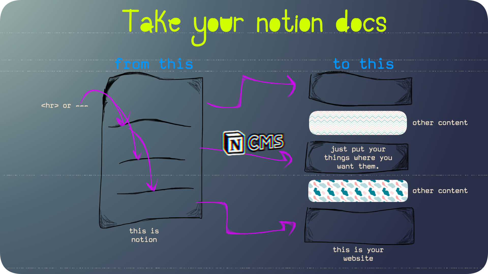

# ncms-plugin-segment

With [NotionCMS](https://github.com/agency-kit/notion-cms).Need we say more?

Not using NotionCMS?! It lets you effortlessly leverage your Notion database as a CMS.

Check it out here: https://www.agencykit.so/notion-cms/guide/

---

## Usage



Okay, well it's pretty basic:

1. Use [NotionCMS](https://github.com/agency-kit/notion-cms)
2. Download this package `npm i -D ncms-plugin-segment`
3. Install the plugin

```
new NotionCMS({
  databaseId: '...your db',
  notionAPIKey: process.env.YOUR_KEY,
  plugins: [
    ncmsSegmentPlugin(),
  ]
})
```

4. Use horizontal rules in your pages where you want to break into sections.
5. Now your `ncms` page objects will have a `sections` property holding an array of all of your sections.
6. Sprinkle them around as you wish.

## Options

### keepRules `boolean`

By default this plugin strips out the horizontal rules in the process but if you happen to want them in your html, set this to `true`.
